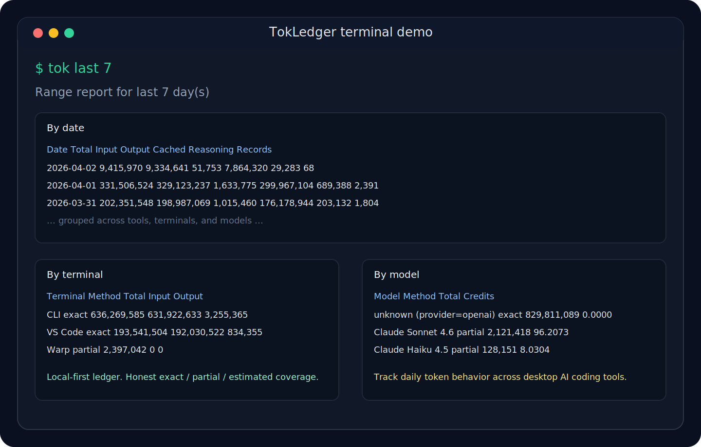

# TokLedger

TokLedger is a local-first token ledger for desktop AI coding tools.

It pulls together fragmented usage from terminal agents, IDE assistants, and
local AI helpers into one consistent daily view. The CLI is `tokstat`, and the
operator shortcut is `tok`.

TokLedger 是一个面向桌面 AI 编码工具的本地 Token 台账。

它把终端 Agent、IDE 助手和本地 AI 工具分散的使用数据统一整理到一个视图里。CLI 主入口是 `tokstat`，可选的 Shell 快捷命令是 `tok`。



## Why TokLedger

Most AI coding tools expose usage in separate places, with different levels of
accuracy and different reporting models. TokLedger normalizes that data into a
single local SQLite ledger and makes the measurement method explicit.

What it does well:

- local-first reporting with no hosted dashboard requirement
- exact accounting where the source supports it
- explicit `partial` and `estimated` labels where it does not
- multi-tool daily reports by date, terminal, model, source, and client
- shell-first workflow for people living in terminal and Kaku
- report commands that auto-scan before rendering
- built-in ASCII trend charts for multi-day reports

## Supported sources

- Codex Desktop and Codex CLI
- Warp AI / Agent Mode
- Kaku Assistant through an OpenAI-compatible local proxy
- CodeBuddy from local task-history estimation

All normalized records are stored in `~/.tokstat/usage.sqlite`.

## Accuracy model

- `exact`: vendor logs or upstream responses expose concrete usage values
- `partial`: useful totals exist, but per-day or per-direction detail is limited
- `estimated`: usage is reconstructed from local cached text, not provider usage

Current source behavior:

- Codex: exact for `input_tokens`, `output_tokens`, `cached_input_tokens`, and `reasoning_tokens`
- Kaku proxy: exact when the upstream response includes OpenAI-style `usage`
- Warp: partial for historical day-level backfill because local data is conversation-based
- CodeBuddy: estimated from locally cached task text

## Highlights

- One ledger across tools instead of separate vendor dashboards
- Honest reporting instead of pretending every number is equally precise
- Daily and multi-day summaries with grouped tables
- Model and terminal breakdowns for behavior analysis
- Client coverage reports for exact vs partial vs estimated totals
- Automatic scan and daily report support via `launchd`
- Fast operator UX with `tok`, inline hints, autosuggest, and completion

## Install

```bash
cd "/path/to/tokledger"
python3 -m venv .venv
source .venv/bin/activate
python3 -m pip install -e .
```

That installs:

- `tokstat`
- `tokledger`
- `tok`

If you already had an older editable install, rerun `python3 -m pip install -e .`
to pick up the `tok` entry point.

## Quick start

Scan all supported adapters:

```bash
tokstat scan-all --timezone Asia/Shanghai
```

Or use the operator shortcut, which auto-scans before rendering reports:

```bash
tok today
tok last 7
```

Show today:

```bash
tokstat report-daily --date today --timezone Asia/Shanghai
```

Show the last week:

```bash
tokstat report-range --last 7 --timezone Asia/Shanghai
```

Show client coverage:

```bash
tokstat report-clients --date today --timezone Asia/Shanghai
tokstat report-clients --last 7 --timezone Asia/Shanghai
```

## Report views

Daily report:

- totals
- by terminal
- by model
- by source
- estimated API cost for priced exact records

Range report:

- total-token trend chart
- date-merged summary
- by terminal
- by model
- by source detail
- estimated API cost for priced exact records

Client report:

- blended totals
- by measurement method
- by date
- by client coverage

## Shell workflow

If you use the optional `tok` shortcut, common flows become:

```bash
tok help
tok pricing
tok today
tok last 7
tok clients month
tok scan warp
```

`tok` defaults to auto-scan before report commands and shows a lightweight
loading indicator while scanning. You can disable or scope that behavior with:

```bash
TOK_AUTO_SCAN_BEFORE_REPORTS=0 tok today
TOK_AUTO_SCAN_TARGET=codex tok last 7
```

Cost notes:

- `Est.$` is a local API cost estimate based on built-in model pricing profiles
- `tok pricing` shows the current built-in price table used by `Est.$`
- `Credits` remains separate for sources like Warp that expose vendor credits
- partial sources may show `Input/Output/Cached/Reasoning` as `-` and `Est.$` as `-`
  when only conversation-level totals are available

## Automatic mode on macOS

The project supports both manual and automatic operation.

Manual:

- run scans yourself
- render reports on demand

Automatic:

- scan every hour
- generate yesterday's report every day at `00:05`

Install the LaunchAgents:

```bash
./scripts/install_launchd.sh
```

Generated files:

- database: `~/.tokstat/usage.sqlite`
- reports: `~/.tokstat/reports/YYYY-MM-DD.txt`
- logs: `~/.tokstat/logs/*.log`

Remove the background jobs:

```bash
./scripts/uninstall_launchd.sh
```

## Kaku proxy

To capture Kaku usage precisely, run a local OpenAI-compatible proxy in front
of your real provider:

```bash
tokstat serve-proxy \
  --host 127.0.0.1 \
  --port 8765 \
  --upstream-base-url https://api.vivgrid.com/v1 \
  --timezone Asia/Shanghai
```

Then point Kaku to the local proxy:

```toml
base_url = "http://127.0.0.1:8765"
```

The proxy forwards requests and records token usage from upstream responses.

## Recommended first release framing

TokLedger should be presented as:

- a Mac-first local CLI alpha
- best for people using several AI coding tools on one machine
- strongest today on daily reporting, trend visibility, and usage honesty

## Publish notes

Repository planning and release packaging notes live in:

- `docs/PRODUCT_BRIEF.md`
- `docs/GITHUB_PUBLISH_PLAN.md`
