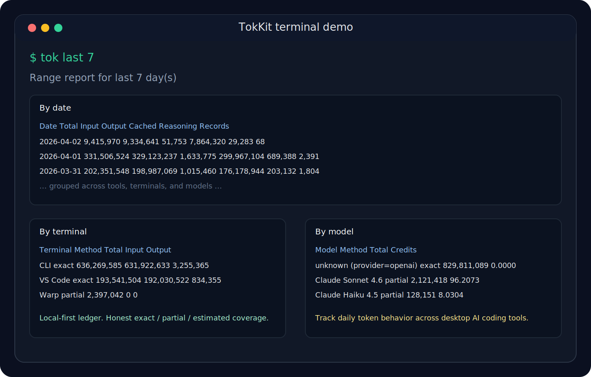

# TokKit

[English](README.md) | [简体中文](README.zh-CN.md)

[产品简介](docs/PRODUCT_BRIEF.md) | [Positioning & roadmap](docs/POSITIONING_AND_ROADMAP.md) | [定位与路线图（简体中文）](docs/POSITIONING_AND_ROADMAP.zh-CN.md)

TokKit 是一个轻量化、本地优先的 AI 编码工具使用量台账。它面向
Codex、Warp、Kaku、CodeBuddy 等桌面工作流，把分散在本机日志、代理响应
和会话聚合数据里的 token、成本、模型、终端和客户端统一到账本里；对于
基于本地日志的来源，不要求 SDK 埋点。核心 CLI 是 `tokkit`，更偏操作流
的快捷命令是 `tok`，`tokstat` 作为兼容别名保留。

一句话定位：

- TokKit 是一个轻量化、本地优先、终端优先的 AI 编码工具总账，把碎片化
  usage 变成一份诚实、可解释的 token 和成本台账。



## 它和通用方案有什么不同

大多数 LLM observability 产品默认你拥有应用本身，并且可以接入埋点。
TokKit 的出发点不同：你是在一台电脑上同时使用多个 AI 编码工具，需要
一份可信的本地账本，而不是一整套云端平台。

TokKit 重点强化的是：

- 轻量化：一个本地 SQLite 台账、一套终端工作流，不依赖托管仪表盘
- 本地优先：数据默认留在本机，除非你主动导出
- 对精度诚实：`exact`、`partial`、`estimated` 明确区分
- 面向 AI 编码工具：终端助手、桌面客户端、IDE 扩展、本地代理
- 低接入成本：能读本地日志就不要求埋点，只有需要精确 usage 时才走代理
- 适合个人使用：日报、趋势、定价、灰色提示、自动补全都直接在终端完成
- 本地诊断直接可用：`tok doctor` 会把配置状态、覆盖率和下一步动作集中说明

## 当前支持的数据来源

- Codex Desktop 和 Codex CLI
- Warp AI / Agent Mode
- 通过 OpenAI-compatible 本地代理接入的 Kaku Assistant
- 基于本地任务历史做估算的 CodeBuddy

所有归一化后的记录都保存在：

- 默认是 `~/.tokkit/usage.sqlite`
- 如果你的机器上已经有 `~/.tokstat`，TokKit 会继续兼容使用旧目录

## 精度模型

- `exact`：供应商日志或上游响应里直接暴露了明确 usage
- `partial`：能拿到总量，但拿不到按日或按方向拆分
- `estimated`：根据本地缓存文本离线重算，不是供应商账单

当前各来源的实际情况：

- Codex：可精确拿到 `input_tokens`、`output_tokens`、`cached_input_tokens`、`reasoning_tokens`
- Kaku proxy：如果上游响应带 OpenAI 风格 `usage`，就能精确统计
- Warp：本地更适合拿会话级 token 总量和 credits，历史按日拆分是 `partial`
- CodeBuddy：根据本地任务文本估算，因此是 `estimated`

## 核心特点

- 一个总账，而不是每家工具一个面板
- 一个轻量化、本地 CLI，而不是一套重型 observability 平台
- 对精度诚实，不把 `partial` 和 `estimated` 伪装成 `exact`
- 支持日报、多日报表格和趋势图
- 支持模型、终端、来源、客户端覆盖率分析
- 支持本地价格覆盖和估算成本视图
- 支持通过 `launchd` 自动扫描和自动日报
- 支持 `tok`、灰色提示、自动补全等终端体验增强

## 3 步安装

```bash
cd "/path/to/tokkit"
python3 -m venv .venv
source .venv/bin/activate
python3 -m pip install -e .
```

安装后会得到这些命令：

- `tokkit`
- `tok`
- `tokstat` 兼容别名

如果你之前已经做过较早版本的 editable install，再执行一次：

```bash
python3 -m pip install -e .
```

这样可以拿到新的 `tok` 入口。

## 首次使用流程

1. 先确认命令已经安装好：

```bash
tok help
tok doctor
tok pricing
```

2. 直接看第一份报表：

```bash
tok today
tok last 7
```

3. 如果你更喜欢底层 CLI，也可以直接执行：

```bash
tokkit report-daily --date today --timezone Asia/Shanghai
tokkit report-range --last 7 --timezone Asia/Shanghai
```

## 可选接入路径

### 手动扫描

显式扫描所有支持的适配器：

```bash
tokkit scan-all --timezone Asia/Shanghai
```

### Kaku 精确统计

如果你想精确统计 Kaku 的 token，可以先启动本地 OpenAI-compatible 代理：

```bash
tokkit serve-proxy \
  --host 127.0.0.1 \
  --port 8765 \
  --upstream-base-url https://api.vivgrid.com/v1 \
  --timezone Asia/Shanghai
```

然后把 Kaku 指向本地代理：

```toml
base_url = "http://127.0.0.1:8765"
```

### macOS 自动模式

如果你希望它自动运行，可以安装 LaunchAgents。安装后会：

- 每小时扫描一次
- 每天 `00:05` 自动生成前一天日报

安装：

```bash
./scripts/install_launchd.sh
```

卸载：

```bash
./scripts/uninstall_launchd.sh
```

## 报表命令

更偏操作流的 `tok` 命令会在出报表前自动扫描：

```bash
tok today
tok last 7
```

底层 CLI 等价命令：

```bash
tokkit report-daily --date today --timezone Asia/Shanghai
tokkit report-range --last 7 --timezone Asia/Shanghai
tokkit report-clients --date today --timezone Asia/Shanghai
tokkit report-clients --last 7 --timezone Asia/Shanghai
```

## 报表视图

日报：

- totals
- by terminal
- by model
- by source
- 对可计价的 `exact` 记录给出 `Est.$`

区间报表：

- total-token 趋势图
- 按日期合并汇总
- by terminal
- by model
- by source 明细
- 对可计价的 `exact` 记录给出 `Est.$`

客户端报表：

- blended totals
- 按 measurement method 聚合
- 按日期聚合
- 客户端覆盖率视图

## Shell 工作流

常用命令：

```bash
tok help
tok doctor
tok pricing
tok today
tok last 7
tok clients month
tok scan warp
```

`tok` 默认会在报表命令前自动扫描，并在扫描时显示轻量级加载提示。你也可以通过环境变量调整：

```bash
TOK_AUTO_SCAN_BEFORE_REPORTS=0 tok today
TOK_AUTO_SCAN_TARGET=codex tok last 7
```

## 成本说明

- `Est.$` 是本地 API 成本估算，不是供应商最终账单
- `tok pricing` 可以查看当前 `Est.$` 使用的价格表
- 如果存在 `~/.tokkit/pricing.json`，TokKit 会在内置价格表之上做覆盖
- 如果你还在使用旧目录，`~/.tokstat/pricing.json` 也会继续兼容
- `tok pricing` 会标出每一条价格来自 `built-in` 还是 `override`
- `tok doctor` 会集中展示本地配置、自动化状态和客户端覆盖率
- `Credits` 会继续保留给 Warp 这类直接提供 credits 的来源
- `partial` 来源如果拿不到方向拆分，`Input/Output/Cached/Reasoning` 会显示 `-`

价格覆盖文件示例：

```json
{
  "GPT-5.4": {
    "input_per_million": 2.7,
    "cached_input_per_million": 0.27,
    "output_per_million": 16.0
  },
  "Claude Sonnet 4.6": {
    "input": 3.2,
    "cached_input": 0.32,
    "output": 16.0
  }
}
```

生成物位置：

- 数据库：`~/.tokkit/usage.sqlite`
- 日报：`~/.tokkit/reports/YYYY-MM-DD.txt`
- 日志：`~/.tokkit/logs/*.log`

## 进一步阅读

- `docs/PRODUCT_BRIEF.md`
- `docs/POSITIONING_AND_ROADMAP.md`
- `docs/POSITIONING_AND_ROADMAP.zh-CN.md`
- `docs/GITHUB_PUBLISH_PLAN.md`
